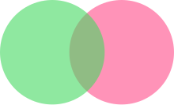

<div align="center">
  <br>
  <br>

  

  <br>
</div>

# color-blend

[](https://greenkeeper.io/)
[](https://standardjs.com)
[](https://travis-ci.org/Loilo/color-blend)
[](https://ci.appveyor.com/project/Loilo/color-blend)
[](https://npmjs.com/package/color-blend)

> Blends RGBA colors with different blend modes

JavaScript implementation of the blend modes introduced in the [W3C Compositing and Blending spec](https://www.w3.org/TR/compositing-1/).

## Install
```console
$ npm install color-blend --save
```

## Usage

### Example
It's simple to wrap your head around, you should get it after just reading this:

```js
var blender = require('color-blend')

// Mix some green and pink tones
// By the way, those are the colors from the logo above
var backdrop = { r: 255, g:   0, b: 87, a: 0.42 }
var source   = { r:  70, g: 217, b: 98, a: 0.6  }

blender.normal(backdrop, source)
// Returns { r: 110, g: 170, b: 96, a: 0.768 }
```

### Explanation
This module exports an object—let's agree on calling it `blender` in this guide—which provides all blend modes listed in the W3C document as methods. Those are:
`normal`, `multiply`, `screen`, `overlay`, `darken`, `lighten`, `colorDodge`, `colorBurn`, `hardLight`, `softLight`, `difference`, `exclusion`, `hue`, `saturation`, `color` and `luminosity`.

They all work the same: Each of these methods takes a `backdrop` color and a `source` color as arguments. Those parameters are expected to be RGBA colors represented as plain objects containing the keys `r`, `g`, `b` (each ranging from 0 to 255) and `a` (ranging from 0 to 1).

The result of the blending operation will be returned as such an RGBA object as well.

### Options
The `blender` also has an `options` property containing the default blending settings. Change those if you'd like to alter the behaviour of the module.

Here's the default options:

```js
{

  // Set this to true if you want to provide color channel values from 0 to 1 instead of 0 to 255
  unitInput: false,

  // As in the above, but for the result
  unitOutput: false,

  // Set this to false if the result color channel values should not be rounded (only applies if `unitOutput` is false)
  roundOutput: true

}
```
